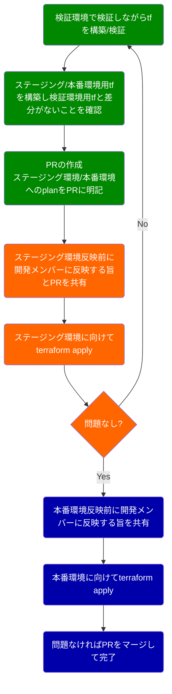

# これまでの実績

## SIer時代

2008年4月から2016年の2月末まで、国内の大手メーカー系SIerで、受託開発案件で、主にプロジェクトを推進する役割を担ってきました。
要件定義やプロジェクト計画の立案から推進を中心に業務に従事し、偉い人の目を盗んで自分でも開発(主にサーバサイド・インフラ)もやっていました。
※ やったことは多々ありますが、ほぼ割愛しています。

### スマートフォン向けの動画見放題サービスのプロジェクト推進

<details>
<summary>
最大会員数200万人弱の国内最大級のスマフォ向けアニメ見放題サービス開発プロジェクトのプロジェクトリード
</summary>

最大会員数200万人弱となる、国内最大級のスマフォ向けアニメ見放題サービスを、ローンチまでの設計・開発・受け入れ確認の期間3ヶ月のプロジェクトを推進し、無事にローンチさせました。
その際の功績と顧客との信頼関係構築が功を奏し、退職するまでの5年間の間、同プロジェクトに関する継続受注で売上に貢献し続けました。(要所での開発の提案含む)
</details>

## 開発運用の課題発見と改善系

### コードレビュー時のコメントにラベルをつけようぜ運動

<details>
<summary>
コードレビューの治安が不穏に見えたのでラベルつけの提案と浸透活動を実施
</summary>

基本的には、コードを実装した人が責任を持って調査・検討・設計・実装・テスト・リリースをすることを是とし、その責務を全うするサポートとしてコードレビューを依頼する形を取るという考え方で、承認を得るという考え方にならない形でコードレビューの運用を整理。
コードレビューはすべて反映せねばならないという風潮が見受けられたので、あくまでも自責であり、MUST(バグっている)で無い限り、主導権は実装した人にある形にしていくため、コードレビューの推奨フォーマットを規定しました。

具体的には、以下のような運用を推奨し、開発チーム全体に浸透させました。(下記は叩き台で、運用に合わせて育てていく前提としています。)

以下のような、ラベルをつけることを推奨。( のようなbadge画像は使わずに、[NOTE] のようなテキストベースでも、全く問題ありません。)

| バッヂ | ラベル | 用途 | 備考 |
| ---- | ---- | ---- | ---- |
|  | [NOTE] | ただのメモ書き。 | `` |
|  | [ADVICE] | 参考意見や、知っていると便利な知識などの、アドバイス。 | `` |
|  | [QUESTION] | 質問や疑問 | `` |
|  | [NITS] | 本質的ではない、すごい細かい指摘。 | `` |
|  | [REQUEST] | 調査・確認してほしい、ついでにこっちも直してほしいといった依頼事項。 | `` |
|  | [IMO] | In My Opinion.(私ならこうするけど、どうかしら？) | `` |
|  | [MUST] | バグっていたり、危険な実装。(ラベル自体が強いので、なるべく本文は、柔らかい表現を心がけましょう。) | `` |

</details>

### ブランチの命名規則を統一しようぜ運動

<details>
<summary>
gitのブランチの切り方について設計/実装者の意図が明確になるように、ブランチの切り方のルールの提案と浸透活動を実施
</summary>

gitのブランチの切り方が明文化されておらず、設計/実装者の意図が明確になっておらず、秩序がなかったため、推奨ルールの整備と浸透活動を行いました。
ブランチを切る時点で、ある程度何を目的としているか、設計/実装者が意識する形にしていくというのが目的の活動です。

具体的には、以下のようなルールを推奨し、開発チーム全体に浸透させました。(下記は叩き台で、運用に合わせて育てていく前提としています。)

| 名前 | 用途 | 備考 |
| ---- | ---- | ---- |
| feat/ | 機能追加・機能修正 | ※test,refactor,miscなコミットを含んで良い。 |
| fix/ | バグfix | ※test,refactor,miscなコミットを含んで良い。 |
| test/ | テスト追加・テスト修正 | ※テストだけ追加・修正する場合 |
| refact/ | リファクタ | ※リファクタだけ実施する場合 |
| misc/ | その他(プログラム以外のみ) | ※ README.mdの修正だけするなど。 |

</details>

### コミットメッセージの書き方を揃えようぜ運動

<details>

<summary>
commitメッセージについて設計/実装者の意図が明確になるように、commitメッセージの推奨ルールの提案と浸透活動を実施
</summary>

commitメッセージの書き方が明文化されていないため、設計/実装者の意図が明確にならず、秩序がなかったため、推奨ルールの整備と浸透活動を行いました。
私自身は、commit単位でレビューすることが多いため、なるべくcommitを意味がある単位において最小になるように分割してほしいという思いがあり、commitの単位を小さくする指導とともに、commitメッセージの推奨ルールを整理しました。

具体的には、以下のようなルールを推奨し、開発チーム全体に浸透させました。(下記は叩き台で、運用に合わせて育てていく前提としています。)

```text
label[must] (namespace[optional]): title[must]

description[optional]

footer[optional]
```

1. *label* の種類
    - feat: 機能追加・修正
    - fix: バグfix
    - refact: リファクタ
    - test: テスト修正・テスト追加のみの場合(featと同じタイミングでコミットする場合はfeatを使う)
    - docs: ドキュメント修正(コメント含む)
    - style: レイアウト微調整など
    - perf: パフォーマンス関連の修正
    - chore: その他
1. *namespace* is put in parenthesis after label and is optional.
1. *title* is a brief summary of changes.
1. *description* is **optional**, new-line separated from title and is in present tense.
1. *footer* is **optional**, new-line separated from *description* and contains "fixes" / "references" attribution to github issues.

Example:

```text
fix(Page): fix page.pizza method

This patch fixes page.pizza so that it works with iframes.

Fixes #123, Fixes #234
```

参考元：

- [angular.jsのガイドライン](https://github.com/angular/angular.js/blob/master/DEVELOPERS.md#-git-commit-guidelines)
- [puppeteerのガイドライン](https://github.com/GoogleChrome/puppeteer/blob/master/CONTRIBUTING.md#commit-messages)

</details>

### 自動テスト書こうぜ運動

<details>
<summary>
自動テストを書くのが個々人に委ねられていたので、書いて当然となるように浸透活動をし続け、当然書く文化を浸透させた
</summary>

人によって自動テストを書いたり書かなかったりしていた(スタートアップ黎明期なので一定仕方ないこと)ので、以下のStepで浸透活動を続け、何も言わなくとも全員が自発的に自動テストを書くところまで牽引しました。

1. codecovを使ったcoverageの見える化
1. 開発工数の一定割合(月に２日)を使えるように働きかけ
1. エンジニアの目標の一つとして、coverageの向上を掲げた上で活動を推進
    - 主に、modelやcontrollerやバッチ処理を対象に、70%超えを目指しました
    - e2eテスト(feature spec)は、コストパフォーマンスが悪いので、意図的に除外
1. 2年ほどかけて、充足したので、運動自体はクローズ
    - この時点で、既に後からの参画者も自然にテストコードを書くようになっています

</details>

### ローカル開発環境のDocker化の提案/構築と浸透

<details>
<summary>
ローカル環境依存による問題を減らすため、ローカル開発環境のDocker化を完遂しました
</summary>

ローカル環境依存による開発環境構築の不具合や、本番環境のDocker化を見据えて、ローカル環境のDocker化を完遂しました。
また、導入当初は、Dockerの知見が弱かったため、エンジニア全体にむけて、基本的なDockerの知識・活用方法に関する勉強会を開催しました。
</details>

### Ansibleの導入とチームへの浸透

<details>
<summary>
インフラが全て手メンテだったので、Ansibleを導入し、チームへの浸透活動を実施
</summary>

インフラに強い人がおらず、創業メンバーが構築したインフラ(手順もない)だった(スタートアップ黎明期なので一定仕方ないこと)ので、ミドルウェアの管理をAnsibleに起こしていきました。

以下のStepで浸透活動を続け、最終的に主要なEC2の中身の管理を完全にAnsible管理下に置きました。

1. 自動テスト書こうぜ運動のときに、開発工数の一定割合(月に２日)を、エンジニアが改善に利用できる工数とした
1. それを使ってコツコツと現状調査と移植を実施
    - [詳細はPaizaTeckBookの無法地帯のインフラの耕し方参照](https://paiza-tech-book.s3-ap-northeast-1.amazonaws.com/paiza-tech-book.pdf)
1. 並行してAnsibleの勉強会を実施し、全エンジニアが利用するように牽引
1. 一通りAnsible化ができた後、EC2の刷新(Amazon Linux2切り替えの提案を含む)を行い、完全管理下に移植

※ 最終的にEC2は撤廃し、Ansibleは減らして、Terraform化を進めています

</details>

### 主要なEC2の撤廃の完遂

<details>
<summary>
管理するインフラを減らすため主要なEC2の撤廃とECS(FARGATE)への移行を完遂しました
</summary>

Ansible化したものの、EC2を保守し続けるのは不毛であり、採用面でも悪い印象を持たれるようになってきていたため、主要なEC2インスタンスをECSに移植しきりました。
</details>

### 手動デプロイから自動デプロイへの移行の完遂

<details>
<summary>
1日に何度もデプロイするため、手動デプロイを自動デプロイに切り替えました
</summary>

EC2をEC2に移行し、Dockerベースで管理/運用する形にしたので、手動でのデプロイ(Capistrano)を、CodeBuildを使った自動デプロイに刷新しました。

</details>

### CI/CD高速化

<details>
<summary>
ECS移行に伴い、Dockerのbuild時間がボトルネックになっていたため、2倍以上の高速化を実現
</summary>

[詳細はコチラを参照ください：デプロイ・ビルドパイプラインを倍速にするテクニック](https://zenn.dev/paiza/articles/improve-codebuild-performance-1)
</details>

### AWSのアカウント分離の完遂

<details>
<summary>
テスト環境・本番環境が同居しており、ヒューマンエラーによる障害も発生していたため、AWSのアカウントを分離・移行を完遂
</summary>

一つのAWSアカウントに、テスト環境・本番環境が同居しており、一部のリソースについては、テスト環境が本番環境のものを参照しているケースもあったため、移行方式を整理した上で、AWSアカウントを分離し、本番用のAWSアカウントとテスト用のAWSアカウントを分離しました。
また、インフラの移行についても、推進を行い、完遂しています。
</details>

### RDSのAurora移行

<details>
<summary>
RDS(MySQL)のリードレプリカ構成だったものを、Auroraに移行
</summary>
もともとは、RDS(MySQL)のリードレプリカ構成だったものが、リードレプリカのレプリケーション遅延による、業務不都合がでてきたため、アーキテクチャ上遅延が起こり得ないAurora版に切り替えを完遂しました。

MySQLを8.0.28に上げてしまっていたたため、単純なAurora切り替えができない(当時は8.0.23までしか対応していなかったため)ため、AWS Database Migration Serviceを
利用して、RDS(8.0.28) -> RDS(8.0.23)へのレプリケーションを行い、短時間停止でAuroraへの切り替えを完遂しました。
</details>

### 主要インフラのTerraform化および運用ルールの整備と浸透活動

<details>
<summary>
インフラ環境をTerraform化し、運用ルールを整備し浸透活動を実施
</summary>

インフラ環境に対する変更について以下のような課題がありました。

- インフラ変更に関するレビューが難しい
- インフラ変更に関するTry and Errorがやりづらい
- インフラのノウハウの蓄積・横展開が難しい

上記課題を解決するため、
以下のStepで改善・浸透活動を続け、最終的に主要なインフラのTerraform化を実施し、開発メンバー全員がTerraformスクリプトを調整する状態まで浸透させきりました。

1. 別の課題で、主要インフラを刷新することにしたので、その際にTerraform化を実施
1. Terraformに関してレビュー/反映フローの叩きを提案・推進
1. Terraformのハンズオンを実施
1. 運用を実施(適宜サポート)

以下、運用フローの叩き



</details>

### TypeScript移行の提案と浸透(活動中)

<details>
<summary>
脱CoffeeScriptのモチベーション向上も見越してTypeScript導入と浸透活動(活動中)
</summary>

10年もののRailsアプリケーションにおいて、肥大化し、現代には合わなくなってしまっているCoffeeScriptを削っていくため、TypeScript環境を整備して、新しいものはTypeScriptを利用するように牽引しました。脱CoffeeScriptにあたって、VanillaJSという筋も考えましたが、jsのテストコードを書く文化が構築できていないため、テストがなくてもある程度安全でかつ段階的に安全度をあげていけるようTypeScriptを採用しました。新しい技術の方が、開発メンバーのモチベーションも上げやすいという狙いも含みます。

以下のような流れで実現しています。

1. webpackerの導入(※ 最終的に脱webpackerをしています)
1. TypeScriptが利用できるようwebpacker(webpack)の整備
1. Sample実装の実施
1. 各チームにいくつかTypeScript移植を実施してもらう
    - 不明点や課題点の吸い上げと解決サポートを実施(実際にはほとんど必要なかった)
    - TypeScriptに対する不安感を払拭し、TypeScript移行の納得感を養生
1. 新しいScriptは、TypeScriptにしていく方針を明文化
1. 古いものも,開発チーム全体で徐々に移行(途中)
</details>

### React(単純なjsx/tsx含む)移行の提案と浸透(活動中)

<details>
<summary>
リッチなフロントエンドにjQueryを使わずReactを使うように先導し浸透活動(活動中)
</summary>

リッチなフロントエンドの実現要望が増えてきたので、もともとjQueryを利用していたのを、Vue(2系)を試験導入し、最終的にVueを撤廃して、React(with TypeScript)で実現するようにしました。

以下の流れで実現しています。

1. VueのSFC環境の構築と部分適用
    - 適宜2年ほど活用
1. 世の中の情勢が、Vue < Reactとなった現状を鑑みて、Reactを部分的に導入
    - ライブラリの追加とビルド環境整備を実施
    - tsとの親和性が高かったのも選定理由
1. 各チームにいくつかReactでの実装を実施してもらう
    - 不明点や課題点の吸い上げと解決サポートを実施
    - Reactに対する不安感を払拭し、React利用の納得感を養生
1. 新しいページで、リッチなフロントエンドはReactを利用していく方針を明文化
    - 無理にReactを使わない方針
1. Vueの駆逐(済)
1. 開発運用やコンポーネント設計の課題の抽出と改善(途中)

</details>

### フロントエンド実装環境/レビュー環境整備

<details>
<summary>
フロントエンド開発の新しい標準構成をStorybookとmock(Prism/Caddy)とOpenAPIで実現するように先導し浸透活動（活動中）
</summary>

TODO:詳細を記述する
(Railsで再実装している問題、実装/テストが大変な問題、見た目/インタラクションレビューがやりづらい問題、チームのアサイン状況によってAPIの仕様がボトルネックになって開発が遅くなりがちな問題。を改善)
(API仕様は、OpenAPIを使ってフロントの人もバックエンドの人もAPI仕様書を双方が更新できるような開発フローを構築。mock(Prism/Caddy)とStorybookを活用し、AppRunnerでいつでも誰でも見れる状態を標準構成にしていった)

</details>

### Python2で書かれていたレガシーコードのRuby移行(Ruby統一)

<details>
<summary>
社内標準はRubyだったが、Python2のマイクロサービスがあったのでRubyに統合
</summary>

社内標準では、サーバサイドはRubyに統一していたが、創業当時に作成されたマイクロサービスにPython2での実装があり、誰も修正できない状況だったので、仕様を解析してRubyOnRailsで作り直しました。
また、冗長化されていない・デプロイも手動・監視も不十分で落ちていても能動的に気づけ無いという問題があったので、一通り改善しきりました。
</details>

## チームリード・チームビルド

### リード育成を狙ったDX向上委員会制度の提案と浸透

<details>
<summary>
次期のリーダー育成・リーダー適正の確認の場として、DX向上委員会活動の提案と推進
</summary>

次期リーダーの育成は、座学では難しいと同時に、いきなりリーダーに抜擢するのも難しいというジレンマがあり、なんとかちょっとしたリード経験・リードのメンタリング/コーチング経験を積める場を作れないか？と考えました。
そこで、月に1度実施している、DX(Developer Experience)向上の活動を、個人単位からチーム(委員会と呼称)単位で実施し、委員長を設けることで、経験の場を生み出しました。
また、通常の開発チームとは別にすることで、メンバー交流も促進される形にしました。

委員長には、委員会活動の内容を移譲し、自発的に小さいリード経験が詰めるようにしています

- 目標設計(半年の目標を2回。計1年)
- 委員会活動の牽引
- 成果・振り返りの実施

また、リーダーを育成する立場の人が、委員長のメンタリング/コーチングを実施することで、リーダーを育成するためのノウハウ・実践ができるような運用設計としています。

</details>

### 開発部全体のリーダーとして、チームを牽引

<details>
<summary>
エンジニアに長期的に貢献し続けてもらえるよう尽くす(継続中)
</summary>

エンジニアの離職率が高く、立て直しを図るため「エンジニアのLTV(Life Time Value)の総和を最大化する」というテーマを打ち出して、様々なことを実施しました。

LT≒在籍期間。V≒デプロイ回数

- LT(Life Time)を伸ばす(長期的にサービス成長に貢献してもらう)
  - 広義の意味でのDX(Developer Experience)の向上活動(研究会を開く、リファクタリング時間を確保する、プロトタイプの作成時間を確保するなど)
  - メンバーとの1on1を通じて、課題の吸い上げや、課題解決のサポート、キャリア支援
- V(Value)を伸ばす(貢献度を上げる、生産性を上げる)
  - 生産性の向上(テンプレ化、部品化の促進。自動化の提案、低生産性部分の見える化と改善)
  - ビジネス理解を深めていくための、体制づくり
  - 未経験エンジニアに対するOJTパートナー制度の導入と、未経験採用時の教育・育成指針の立案(OJTをされる側とも一緒に内容を話し合ってたたき台づくり)
- エンジニアを増やす(これを増やさないと総和が増えないため)
  - エンジニア採用専属部隊づくり
  - 多面的な採用活動
    - 即戦力層
    - ポテンシャル(未経験層) (教育制度の立案とセット)
    - 学生バイトからの社員化 (教育制度の立案とセット)
    - 採用広報のためのネタづくり

</details>

## その他

<details>
<summary>
実績ベースでのtopic
</summary>

- rails4 -> rails5 のバージョンアップをリード
  - rails5以降は、メンバーがリードできるよう指導・サポート
  - 2023/07時点で、7.0.4
- ruby2.4 -> ruby2.5移行
  - docker化を実施後は、メンバーが各自できるよう指導・サポート
  - 2023/07時点で、3.2.2
- paizaでの各種ゲームの開発
  - [恋するハッカソン ~君色に染まるアイドル~](https://paiza.jp/poh/hatsukoi)
  - [もし次の常駐先が女子エンジニアばっかりだったら](https://paiza.jp/moshijo)
  - [ロジックサマナー 閃光の召喚プログラマ](https://paiza.jp/logic_summoner)
  - [一攫千金プログラミング~ボットdeジャックポット~](https://paiza.jp/paizajack)
- Ask Me Anything企画の提案と実施
  - 社長とみんなが遠いよねといった課題解決のため
  - エンジニアと非エンジニアが遠いよねといった課題解決のため
  - slackで一定時間、なんでも聞いてねみたいな企画を実現しました。
- 1on1のポイントの明文化
  - 目的が明確ではない1on1をやっていたので、明確化した
- 開発チームのroleとスキルマップの策定(仕掛中)
- 開発チームの年表を作成し、運用を啓蒙した(仕掛り中)
- 社内の図書購入と貸借管理のアプリを作って効率化した
- サーバ証明書の更新の自動化
- 以下、詳細化する(TODO)
  - 社内のMTGをHangoutを使って、ライブ中継する文化を作った
  - 未経験エンジニア採用からの社内教育について、未経験エンジニアも巻き込んでアウトラインを作った(仕掛かり中)
  - 技術的負債返済の文化を全社的に浸透させた
  - 技術的負債という言葉が独り歩きしていて、課題感を感じたので是正した
    - 理想と現実のギャップ -> これは、技術的負債とは呼ばないようにしよう(∵ 一生埋まらないので、疲弊するので)
    - 技術的負債 = チームとして当たり前にしておきたい状態と現実のギャップ(当たり前なので、返済のやり方が明確にわかっている)
    - 技術的闇 = 放置すると絶対にヤバいが、どうしたらいいかわからないようなもの
  - Imageスナップショットテストの導入と運用方法の整備
    - jestを使って、日時で昨日と今日の画像の差分をチェックする仕組みを導入
    - 月一で棚卸しをして、差分をどうするか決める運用を主導
    - ※2019/07/11時点 大きな成果は挙げられていないので、改善策を模索中

</details>