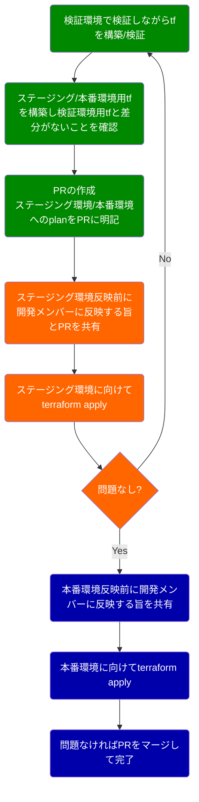

# 主要インフラのTerraform化および運用ルールの標準化と浸透活動

インフラ環境をTerraform化し、運用ルールを整備し浸透活動を実施

インフラ環境に対する変更について以下のような課題がありました。

- インフラ変更に関するレビューが難しい
- インフラ変更に関するTry and Errorがやりづらい
- インフラのノウハウの蓄積・横展開が難しい

上記課題を解決するため、
以下のStepで改善・浸透活動を続け、最終的に主要なインフラのTerraform化を実施し、開発メンバー全員がTerraformスクリプトを調整する状態まで浸透させきりました。

1. 別の課題で、主要インフラを刷新することにしたので、その際にTerraform化を実施
1. Terraformに関してレビュー/反映フローの叩きを提案・推進
1. Terraformのハンズオンを実施
1. 運用を実施(適宜サポート)

以下、運用フローの叩き

